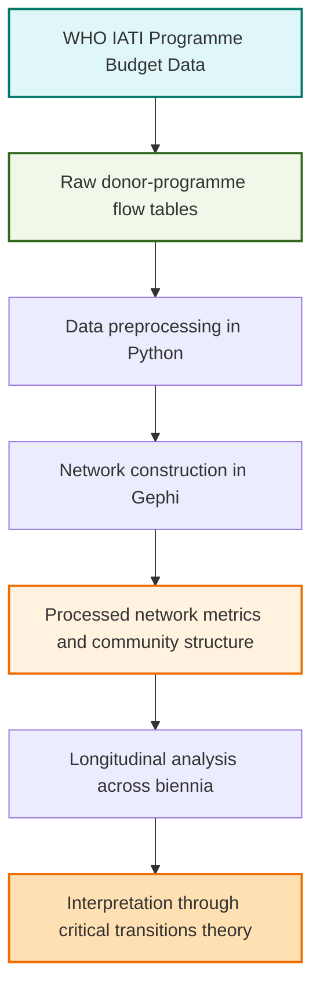

# WHO Financing, Network Fragmentation, and Systemic Risk

Replication materials for the study of WHO financing network fragmentation and systemic risk in global health governance, 2016–2025.

**Associated article:**  
Santos Domínguez, A. B., & Ballesteros Pérez, C. (2026). *Network Fragmentation and the 2025 Funding Shock: Early Warning Signs of Systemic Risk in Global Health Governance*. **McGill Journal of Global Health, 15**(1), 23–31. Published online 28 April 2026. 

**PAPIIT Project:**  
*Critical Transitions in Global Society and World Politics*

---

## Overview

This repository contains replication materials associated with the article:

> Santos Domínguez, A. B., & Ballesteros Pérez, C. (2026). *Network Fragmentation and the 2025 Funding Shock: Early Warning Signs of Systemic Risk in Global Health Governance*. **McGill Journal of Global Health, 15**(1), 23–31.

The study applies social network analysis (SNA) to WHO financing and implementation networks across five programme-budget biennia: 2016–2017, 2018–2019, 2020–2021, 2022–2023, and 2024–2025. It interprets longitudinal structural change through the lens of critical transitions theory, with particular attention to fragmentation, modularity, density, clustering, connectivity, and early-warning dynamics.

In line with principles of research transparency and reproducibility, this repository provides processed network datasets, Gephi statistical outputs, and supporting methodological documentation. The repository is intended to support scrutiny, reuse, and extension of the empirical materials underlying the published article.

---

## Contents

- [Associated publication](#associated-publication)
- [Data description](#data-description)
- [Methodological framework](#methodological-framework)
- [Data workflow](#data-workflow)
- [How to cite](#how-to-cite)
- [Licence](#licence)
- [Contact](#contact)

---

## Associated Publication

Santos Domínguez, A. B., & Ballesteros Pérez, C. (2026). *Network Fragmentation and the 2025 Funding Shock: Early Warning Signs of Systemic Risk in Global Health Governance*. **McGill Journal of Global Health, 15**(1), 23–31. Published online 28 April 2026. No DOI assigned by the journal.

Available at: https://www.mcgill.ca/globalhealth/files/globalhealth/mjgh_2026_1_final.pdf

---

## Data Description

### Raw data (`data/raw/`)

- **Format:** CSV.
- **Source:** WHO Programme Budget datasets from the International Aid Transparency Initiative (IATI).
- **Temporal coverage:** Q4 datasets for 2016–2023 and Q1 dataset for 2024–2025.
- **Scope:** Donor–programme and donor–country/region funding flows.
- **Exclusion criterion:** WHO Headquarters allocations are excluded to avoid disproportionate centralisation effects in the network structure.
- **Use:** Construction of directed, weighted graphs representing WHO financing networks by programme-budget biennium.

### Processed data (`data/processed/`)

- **Format:** CSV.
- **Generated outputs:** Network-level and node-level measures produced through Gephi v0.10.1.
- **Metrics include:**
  - Degree centrality
  - Betweenness centrality
  - Closeness centrality
  - Network density
  - Clustering coefficient
  - Weakly connected components
  - Newman–Girvan modularity
  - Community assignments using the Louvain algorithm

- **Purpose:** Longitudinal assessment of structural change in WHO financing networks across five biennia, including variation in density, modularity, clustering, connectivity, and early-warning indicators such as rising variance and temporal autocorrelation.

---

## Methodological Framework

The study combines social network analysis with concepts from critical transitions theory.

The theoretical framework draws on the literature on critical transitions, resilience, alternative stable configurations, hysteresis, and early-warning indicators. These concepts are used heuristically to interpret whether changes in WHO financing networks are consistent with increasing fragmentation and potential systemic vulnerability.

The empirical strategy uses social network analysis to examine structural changes in WHO financing ties. The analysis focuses on longitudinal variation in network density, modularity, clustering, connectivity, and component structure. Modularity is interpreted alongside other structural indicators rather than as a standalone measure of systemic risk.

### Tools

- Data processing: Python 3.11.13 and `pandas`
- Computational environment: Google Colab
- Network analysis and visualisation: Gephi v0.10.1
- Community detection: Louvain algorithm, resolution = 0.8
- Modularity measure: Newman–Girvan modularity

---

## Data Workflow

---

## How to Cite

Please cite both the published article and the archived repository.

**Article**

Santos Domínguez, A. B., & Ballesteros Pérez, C. (2026). Network Fragmentation and the 2025 Funding Shock: Early Warning Signs of Systemic Risk in Global Health Governance. *McGill Journal of Global Health*, 15(1), 23–31. Published online 28 April 2026. No DOI assigned by the journal. https://www.mcgill.ca/globalhealth/files/globalhealth/mjgh_2026_1_final.pdf

**Repository**

Santos Domínguez, A. B., & Ballesteros Pérez, C. (2026). Replication materials for “Network Fragmentation and the 2025 Funding Shock: Early Warning Signs of Systemic Risk in Global Health Governance” (Version 1.0.0) [Research materials]. Zenodo. DOI: TO BE ADDED AFTER RELEASE.

---

## Licence

This repository is shared under the Creative Commons Attribution 4.0 International licence (CC BY 4.0), unless otherwise indicated.

Users should cite the associated publication and the archived version of this repository when reusing the materials.

---

## Contact

For questions regarding the repository or replication materials, please contact:

Adela B. Santos Domínguez
Global Health Centre, Geneva Graduate Institute / UNAM
adela.santos@graduateinstitute.ch

Carlos Ballesteros Pérez
Facultad de Ciencias Políticas y Sociales, UNAM
ballesterc@politicas.unam.mx

---

## License
This repository is licensed under the Creative Commons Attribution 4.0 International License (CC BY 4.0), unless otherwise indicated.

See the [LICENSE](LICENSE) file for details.
