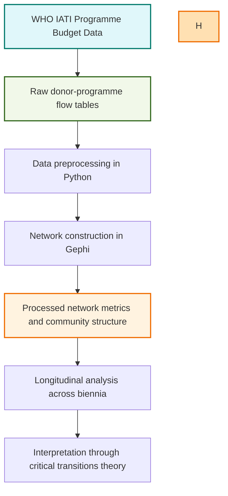

# who-financing-systemic-risk

Replication materials for the study of WHO financing network fragmentation and systemic risk in global health governance, 2016–2025.

**PAPIIT Project – Critical Transitions in the Global Society and World Politics**  
**Network datasets and Gephi statistical outputs for the study:**  
*“Network Fragmentation and the 2025 Funding Shock: Early Warning Signs of Systemic Risk in Global Health Governance”*

---

## Overview

This repository hosts the datasets and processed outputs used in the article:

> Santos Domínguez, A. B., & Ballesteros Pérez, C. (forthcoming). *Network Fragmentation and the 2025 Funding Shock: Early Warning Signs of Systemic Risk in Global Health Governance*. McGill Journal of Global Health.

The study applies social network analysis (SNA) to the WHO financing and implementation network (2016–2025) and interprets longitudinal structural change through the lens of critical transitions theory.

In line with principles of research transparency and reproducibility, this repository contains processed network datasets, Gephi statistical outputs, and supporting methodological documentation.

---

## Contents
- [Data description](#data-description)
- [Methodological framework](#methodological-framework)
- [Data workflow](#data-workflow)
- [How to use](#how-to-use)
- [Licence](#licence)
- [Contact](#contact)

---

## Data Description

### Raw data (`data/raw/`)
- **Format:** CSV (comma-separated values)  
- **Source:** WHO Programme Budget datasets from the International Aid Transparency Initiative (IATI) — Q4 datasets for 2016–2023 and Q1 dataset for 2024–2025.
- **Scope:** Donor–programme (country/region) funding flows, excluding WHO Headquarters allocations to avoid disproportionate centralisation effects.  
- **Use:** Construction of directed, weighted graphs representing WHO’s financing network per biennium.

### Processed data (`data/processed/`)
- **Format:** CSV  
- **Metrics generated in Gephi (v0.10.1):**
  - Degree, betweenness, and closeness centrality
  - Network density
  - Newman–Girvan modularity
  - Community assignments (Louvain algorithm, resolution = 0.8)  
- **Purpose:** Longitudinal assessment of network structure across five biennia (autocorrelation, variance). 

---

## Methodological Framework
- **Theoretical basis:** Critical transitions theory (resilience, hysteresis, alternative configurations, early-warning dynamics).
- **Analytical approach:** Social network analysis of WHO financing ties, with particular attention to changes in density, modularity, clustering, and connectivity over time.
- **Tools:**
  - Data processing: Python 3.11.13 (`pandas`), Google Colab  
  - Network analysis & visualisation: Gephi v0.10.1

---

## Data Workflow (Mermaid)

## Licence

This repository is shared under the Creative Commons Attribution 4.0 International (CC BY 4.0) licence, unless otherwise indicated.

## Contact

For questions regarding the repository or replication materials, please contact:

Adela B. Santos Domínguez — Geneva Graduate Institute / UNAM — adela.santos@graduateinstitute.ch  
Carlos Ballesteros Pérez — UNAM — ballesterc@politicas.unam.mx 
